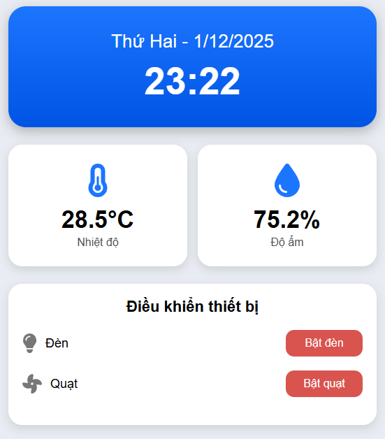

# 🌱 Hệ thống Quản Lý Trang Trại Thông Minh (IoT ESP32)

## 📖 Giới thiệu
Dự án này xây dựng một hệ thống **quản lý trang trại thông minh** dựa trên nền tảng **ESP32** kết hợp với **Front-end Web** và **Back-end API**.  
Mục tiêu: **giám sát và điều khiển các thiết bị trong trang trại** (cảm biến nhiệt độ, độ ẩm, ánh sáng, thiết bị tưới tiêu...) thông qua giao diện web hiện đại và API mạnh mẽ.

---

## 🏗️ Kiến trúc hệ thống
Hệ thống gồm 3 thành phần chính:

### 1. ESP32 (IoT Device)
- 📂 Repository: [Esp32_trangtrai](http://github.com/VIET-ANH-NGUYEN1009/Esp32_trangtrai/tree/main)  
- 🔧 Chức năng:
  - Thu thập dữ liệu từ cảm biến (nhiệt độ, độ ẩm, ánh sáng, đất, nước...)
  - Gửi dữ liệu về server qua WiFi/MQTT/HTTP
  - Nhận lệnh điều khiển từ API (bật/tắt bơm, quạt, đèn...)

### 2. Front-end (Web UI)
- 📂 Repository: [QuanLyTrangTrai](https://github.com/VIET-ANH-NGUYEN1009/QuanLyTrangTrai)  
- 🖥️ Công nghệ: ReactJS / HTML / CSS / JavaScript  
- 🔧 Chức năng:
  - Hiển thị dữ liệu cảm biến theo thời gian thực
  - Dashboard trực quan để quản lý thiết bị
  - Biểu đồ, thống kê, cảnh báo

### 3. Back-end (API Server)
- 📂 Repository: [api.quan_ly_trang_trai](https://github.com/VIET-ANH-NGUYEN1009/api.quan_ly_trang_trai)  
- ⚙️ Công nghệ: Node.js / Express / MongoDB  
- 🔧 Chức năng:
  - Cung cấp API cho ESP32 và Front-end
  - Lưu trữ dữ liệu cảm biến
  - Quản lý người dùng, phân quyền
  - Xử lý logic điều khiển thiết bị

---

## 📊 Demo Tính năng

- Giám sát dữ liệu cảm biến theo thời gian thực
- Biểu đồ trực quan (nhiệt độ, độ ẩm, ánh sáng, đất, nước)
- Điều khiển thiết bị từ xa (bơm, quạt, đèn…)
- Cảnh báo khi vượt ngưỡng an toàn
- Quản lý người dùng & phân quyền

### 🖼️ Giao diện minh họa




## ⚙️ Cài đặt & Chạy thử

### 1. ESP32
- Cài đặt **Arduino IDE** hoặc **PlatformIO**
- Clone repo ESP32:
```bash
git clone https://github.com/VIET-ANH-NGUYEN1009/Esp32_trangtrai.git

**## 📊 Demo Tính năng


